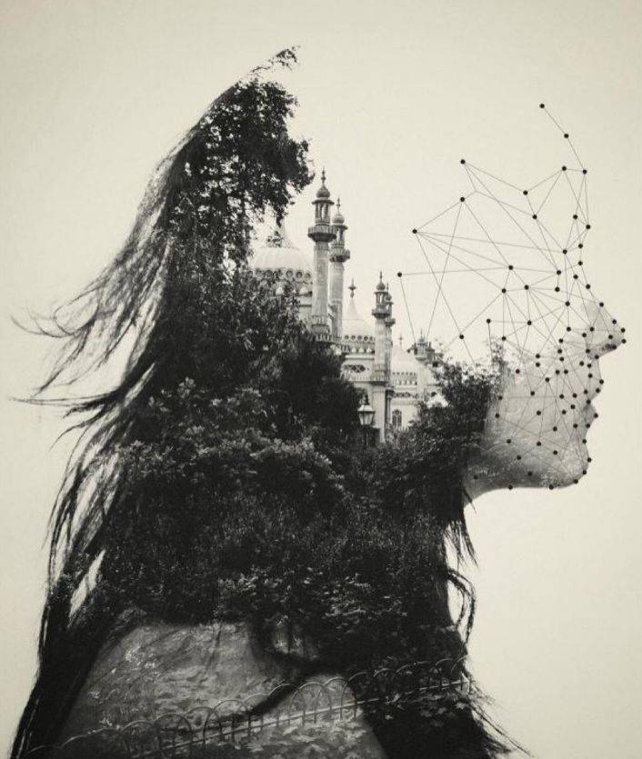

# qzhu5155_9103_tut1

This is repo that I will use to do the Assignment!

## QUIZ 8

*Part 1: Imaging Technique Inspiration*

I find the "double exposure" photographic imaging technique inspiring: merging two images to create a single hybrid composition. I am drawn to this technique for its ability to convey complex storytelling and emotion through the overlay of visual elements. Using Double Exposure in my assignments allows me to achieve a sense of interconnectedness and duality in the artwork I choose to create. In assignments, I can also use this imaging technique to construct multiple shadows and the overlapping of different lines or shapes.

- Part1-Example Image:
  

*Part 2: Coding Technique Exploration*

From my research, if I want to implement the "double exposure" technique, using p5.js works very well. The “blend” feature in p5.js allows for the overlaying and blending of two images, simulating the effect of a double exposure. By carefully adjusting the blending mode and transparency level of each layer, I can achieve the desired effect of merging two visual effects into one. And the feature also offers the flexibility of different blending modes to create diverse and eye-catching results.

- Part2-Example Image&Code Link/Ref:

[Example1CodeLink](https://codepen.io/giorgiomartini/pen/GvQVxy?editors=0010)

[Example2RefLink](https://p5js.org/reference/#/p5/blendMode)

[Example3RefLink](https://p5js.org/reference/#/p5/blend)