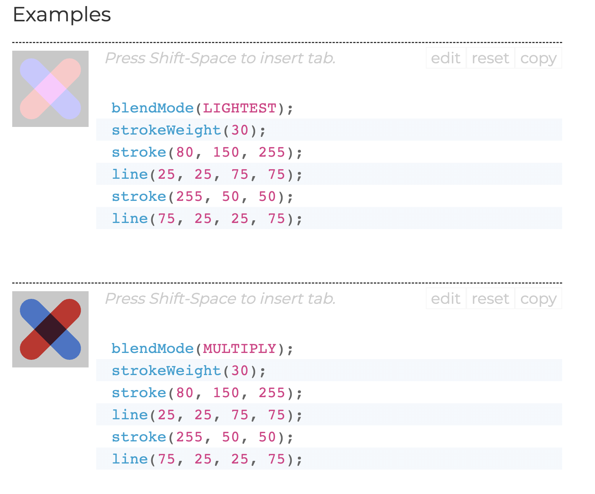

# qzhu5155_9103_tut1

This is a repo that I will use to do the Assignment and Quiz!

## Assignment Interactive Tips

*User - Input 1: Mouse Click

Use the mouse to click the interface to cancel noLoop() and start the animation below.

*User - Input 2: KeyBoard

Control different modes of animation via keyboard.

- Press 'r' to animate Rotation mode
- Press 'e' to animate Ease Zoom mode
- Press 'm' to Interactive Move mode
- Press 'c' to animate Color Change mode
- Press 's' to stop the animation (reset to noLoop() again, need to repeat operation User-Input 1 to stop noLoop())

*User - Input 3: Mouse Pressed & Move In Interactive Move Mode

When the operating mode is on 'm', change the position of the big circle with the mouse.

- Hovering the mouse on any big circle will display a white line, and moving it away will return it to its original state.
- Press and hold the mouse on the selected big circle and drag it to move it freely.

*Group Code Image & Individual Code Display Video

[Link_of_Individual_Animation_Display_Video](https://youtu.be/kBMpdy7D79o?si=ad9m5e61Q86UMd-n)

## QUIZ 8

*Part 1: Imaging Technique Inspiration*

I find the "double exposure" photographic imaging technique inspiring: merging two images to create a single hybrid composition. I am drawn to this technique for its ability to convey complex storytelling and emotion through the overlay of visual elements. Using Double Exposure in my assignments allows me to achieve a sense of interconnectedness and duality in the artwork I choose to create. In assignments, I can also use this imaging technique to construct multiple shadows and the overlapping of different lines or shapes.

- Part1-Example Image:

*Part 2: Coding Technique Exploration*

From my research, if I want to implement the "double exposure" technique, using p5.js works very well. The “blend” feature in p5.js allows for the overlaying and blending of two images, simulating the effect of a double exposure. By carefully adjusting the blending mode and transparency level of each layer, I can achieve the desired effect of merging two visual effects into one. And the feature also offers the flexibility of different blending modes to create diverse and eye-catching results.

- Part2-Example Image&Code Link/Ref:

[Example1CodeLink](https://codepen.io/giorgiomartini/pen/GvQVxy?editors=0010)

[Example2RefLink](https://p5js.org/reference/#/p5/blendMode)

[Example3RefLink](https://p5js.org/reference/#/p5/blend)